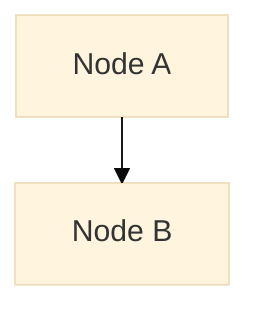

# GitHub 云端同步方案升级计划（方案2：混合方案）

**更新日期**: 2026-01-21
**当前项目**: Mermaid Local 图表管理工具
**目标**: 实现 Dexie 本地缓存 + GitHub 云端同步的混合存储方案

---

## 一、总体设计思路

### 1.1 架构设计目标

| 目标 | 说明 |
|------|------|
| **本地优先** | Dexie 保持本地缓存，加速读写和离线访问 |
| **云端备份** | GitHub 作为云端真实数据源和版本控制 |
| **双向同步** | 本地变更上传 GitHub，GitHub 变更拉取到本地 |
| **冲突解决** | 自动合并策略，用户可手动解决复杂冲突 |
| **用户透明** | 用户无需感知同步细节，自动后台同步 |

### 1.2 核心原则

```
本地 Dexie         GitHub (Cloud)
    ↕ 双向同步 ↕

- 每个用户创建私有仓库
- 自动定时同步（可配置）
- 离线工作不受影响
- 网络恢复自动补偿
- 冲突时保留两个版本
```

---

## 二、数据模型设计

### 2.1 GitHub 仓库结构

```
user-mermaid-repo/
├── README.md                      # 项目文档
├── .gitignore                     # Git 忽略文件
├── .github/
│   └── workflows/
│       └── sync.yml              # GitHub Actions 工作流（可选）
├── data/
│   ├── projects.json             # 所有项目元数据
│   ├── projects/
│   │   └── [project-id]/
│   │       ├── meta.json         # 项目元数据
│   │       └── diagrams/
│   │           └── [diagram-id].mmd    # 图表源码
│   └── snapshots/
│       └── [diagram-id]/
│           └── [snapshot-id].json      # 快照历史
├── config.json                   # 同步配置
└── sync-log.json                # 同步日志
```

### 2.2 GitHub 数据格式

#### projects.json - 项目列表
```json
{
  "version": "1.0.0",
  "lastSync": "2026-01-21T10:30:00Z",
  "projects": [
    {
      "id": "uuid-xxx",
      "name": "项目名称",
      "description": "项目描述",
      "tags": ["标签1", "标签2"],
      "createdAt": "2026-01-21T08:00:00Z",
      "updatedAt": "2026-01-21T09:00:00Z",
      "diagramCount": 5,
      "localSync": true,
      "remoteSync": true
    }
  ]
}
```

#### projects/[project-id]/meta.json - 项目详情
```json
{
  "id": "uuid-xxx",
  "name": "项目名称",
  "description": "项目描述",
  "tags": ["标签1", "标签2"],
  "createdAt": "2026-01-21T08:00:00Z",
  "updatedAt": "2026-01-21T09:00:00Z",
  "diagrams": [
    {
      "id": "diagram-id",
      "name": "图表名称",
      "updatedAt": "2026-01-21T09:00:00Z",
      "checksum": "sha256-hash"
    }
  ]
}
```

#### diagrams/[diagram-id].mmd - 图表文件


#### snapshots/[diagram-id]/[snapshot-id].json - 快照
```json
{
  "id": "snapshot-id",
  "diagramId": "diagram-id",
  "source": "图表源码",
  "checksum": "sha256-hash",
  "createdAt": "2026-01-21T09:00:00Z",
  "description": "修改描述",
  "isAutoSave": false
}
```

### 2.3 本地 Dexie 扩展字段

为现有数据模型添加同步相关字段：

```typescript
// Project 表新增字段
{
  remoteId?: string              // GitHub 中的 ID（可能不同）
  syncStatus: 'pending' | 'synced' | 'conflict' | 'error'
  lastSyncTime?: number          // 最后同步时间戳
  remoteChecksum?: string        // 远端数据 checksum
  localChecksum?: string         // 本地数据 checksum
  syncError?: string             // 同步错误信息
}

// Diagram 表新增字段
{
  remoteId?: string
  syncStatus: 'pending' | 'synced' | 'conflict' | 'error'
  lastSyncTime?: number
  remoteChecksum?: string
  localChecksum?: string
  conflictVersion?: string[]     // 冲突版本列表
  syncError?: string
}

// Snapshot 表新增字段
{
  remoteId?: string
  syncStatus: 'pending' | 'synced' | 'error'
  lastSyncTime?: number
  syncError?: string
}
```

---

## 三、架构改造方案

### 3.1 新增核心模块

#### 1. **GitHub API 封装层** (`/src/services/github.ts`)
```
职责：
- GitHub API 认证和请求处理
- 内容读写（创建/更新/删除文件）
- 仓库初始化和配置
- 错误重试和限流处理
- 请求速率限制管理

主要函数：
- initGitHubClient(token)           // 初始化
- createOrGetRepo()                 // 仓库初始化
- getRemoteData(path)               // 获取远端文件
- pushLocalData(path, content)      // 推送本地数据
- getCommitHistory(path)            // 获取提交历史
- handleGitHubError()               // 错误处理
```

#### 2. **同步协调引擎** (`/src/services/syncEngine.ts`)
```
职责：
- 检测本地和远端数据差异
- 策略性执行同步操作
- 冲突检测和解决
- 同步队列管理
- 重试机制

主要函数：
- startAutoSync()                   // 启动自动同步
- syncProject(projectId)            // 同步单个项目
- syncDiagram(diagramId)            // 同步单个图表
- detectConflicts()                 // 冲突检测
- resolveConflict()                 // 冲突解决
- getSyncStatus()                   // 获取同步状态
- calculateChecksum()               // 计算数据校验和
```

#### 3. **同步队列管理** (`/src/services/syncQueue.ts`)
```
职责：
- 管理待同步操作队列
- 优先级处理
- 批量操作优化
- 队列持久化

主要函数：
- enqueueSync(operation)            // 入队
- dequeueSync()                     // 出队
- processSyncQueue()                // 处理队列
- pauseSync()                       // 暂停
- resumeSync()                      // 恢复
- clearFailedSync()                 // 清除失败项
```

#### 4. **数据差异计算** (`/src/services/dataSync.ts`)
```
职责：
- 计算本地和远端数据差异
- 智能合并策略
- 内容对比

主要函数：
- getDiff(local, remote)            // 计算差异
- mergeData(local, remote, strategy) // 数据合并
- getConflictingFields()            // 获取冲突字段
- applyRemoteChanges()              // 应用远端变更
- prepareLocalChanges()             // 准备本地变更
```

### 3.2 状态管理扩展 (`/src/stores`)

#### 新增 `syncStore.ts`
```typescript
export interface SyncState {
  // 状态信息
  isAuthor: boolean                  // 是否已授权
  isConnected: boolean               // 是否连接到 GitHub
  isSyncing: boolean                 // 是否正在同步
  lastSyncTime: number               // 最后同步时间
  syncError: string | null           // 同步错误

  // 同步统计
  syncStats: {
    totalItems: number               // 总项数
    syncedItems: number              // 已同步项数
    conflictItems: number            // 冲突项数
    errorItems: number               // 错误项数
  }

  // 队列状态
  syncQueue: SyncOperation[]         // 待同步队列

  // 配置
  settings: {
    autoSync: boolean                // 自动同步
    syncInterval: number             // 同步间隔（ms）
    conflictStrategy: 'local' | 'remote' | 'merge' | 'ask'
    onlineBackupEnabled: boolean     // 启用备份
    compressData: boolean            // 压缩数据
  }

  // 操作方法
  authorize(token: string): Promise<void>
  disconnect(): Promise<void>
  syncNow(): Promise<void>
  setAutoSync(enabled: boolean): void
  updateSettings(settings: Partial<typeof settings>): void
  handleConflict(id: string, resolution: 'local' | 'remote' | 'merge'): void
  getSyncStatus(): SyncStatus
}
```

### 3.3 Dexie 数据库扩展

#### 新增表和索引
```typescript
db.version(2).stores({
  // ... 原有表 ...
  syncLog: '++id, timestamp, status',      // 同步日志
  syncQueue: '++id, status, priority',     // 同步队列
  conflictResolutions: 'id, timestamp',    // 冲突解决历史
})
```

---

## 四、同步流程设计

### 4.1 双向同步流程

```
┌─────────────────────────────────────────────────────┐
│              双向同步主流程                          │
└─────────────────────────────────────────────────────┘

1. 初始化阶段
   ├─ 用户登录 GitHub OAuth
   ├─ 初始化/获取仓库
   ├─ 加载 projects.json
   └─ 与本地数据对比

2. 检测变化阶段
   ├─ 扫描本地待同步项
   │  ├─ NEW (本地新增)
   │  ├─ MODIFIED (本地修改)
   │  ├─ DELETED (本地删除)
   │  └─ CONFLICT (冲突检测)
   └─ 扫描远端变化
      ├─ 通过 Git 提交历史检测
      ├─ 通过 checksum 校验
      └─ 通过时间戳对比

3. 冲突检测阶段
   ├─ 同时修改判断
   │  └─ 本地 checksum ≠ 远端 checksum
   │     且 本地 updatedAt ≠ 远端 updatedAt
   ├─ 冲突策略选择
   │  ├─ 本地优先 (keepLocal)
   │  ├─ 远端优先 (keepRemote)
   │  ├─ 版本合并 (merge - 保留两个版本)
   │  └─ 用户选择 (ask)
   └─ 冲突记录

4. 同步执行阶段
   ├─ 入队操作 (按优先级)
   │  ├─ 优先级1: 项目元数据
   │  ├─ 优先级2: 项目配置
   │  ├─ 优先级3: 图表数据
   │  └─ 优先级4: 快照历史
   ├─ 批量推送
   │  ├─ 本地 NEW/MODIFIED 推送到 GitHub
   │  ├─ 本地 DELETED 在 GitHub 中删除
   │  └─ Commit 并记录
   ├─ 拉取远端
   │  ├─ 远端 NEW 创建到本地
   │  ├─ 远端 MODIFIED 更新本地
   │  └─ 远端 DELETED 删除本地
   └─ 更新元数据
      ├─ 更新 syncStatus
      ├─ 更新 lastSyncTime
      └─ 更新 checksum

5. 完成阶段
   ├─ 记录同步日志
   ├─ 更新统计数据
   ├─ 清理待同步队列
   └─ 触发 UI 更新

6. 错误处理
   ├─ 网络错误 → 重试 + 入队
   ├─ 鉴权错误 → 提示重新登录
   ├─ 冲突错误 → 用户手动解决
   └─ 服务器错误 → 记录并稍后重试
```

### 4.2 自动同步策略

```typescript
// 同步触发时机
1. 应用启动时
2. 代码保存时 (30秒内最多一次)
3. 定时同步 (默认每5分钟)
4. 网络恢复时
5. 用户手动触发时

// 同步优化
- 合并操作: 短时间内的多个修改合并为一个 commit
- 批量请求: 多个文件变更合并为一个 API 请求
- 增量同步: 只同步变化的部分
- 压缩传输: 大文件启用 GZIP 压缩
- 本地缓存: 使用 ETag 减少不必要的请求
```

### 4.3 冲突解决策略

```
场景：本地图表和远端图表都被修改

检测方式：
- 本地 checksum ≠ 远端 checksum
- 本地 lastModified ≠ 远端 lastModified

解决选项：
┌─────────────────────────────────────────┐
│ 1. 本地优先 (Keep Local)               │
│    ✓ 保留本地版本                      │
│    ✓ 覆盖远端                          │
│    用途: 自己的最新修改优先             │
├─────────────────────────────────────────┤
│ 2. 远端优先 (Keep Remote)              │
│    ✓ 丢弃本地版本                      │
│    ✓ 使用远端版本                      │
│    用途: 信任云端为真实数据             │
├─────────────────────────────────────────┤
│ 3. 版本合并 (Merge)                    │
│    ✓ 保留两个版本                      │
│    ✓ 在本地显示为分支                  │
│    用途: 保留完整历史                   │
│ 示例:                                  │
│   diagram.name.local.mmd               │
│   diagram.name.remote.mmd              │
│   diagram.name.merged.mmd (自动合并)  │
├─────────────────────────────────────────┤
│ 4. 用户选择 (Ask)                      │
│    ✓ 弹出对话框让用户选择              │
│    ✓ 显示两个版本的对比                │
│    用途: 不确定时交由用户决策           │
└─────────────────────────────────────────┘

冲突记录存储：
- ConflictResolutions 表
  {
    id: string
    projectId: string
    diagramId: string
    timestamp: number
    localChecksum: string
    remoteChecksum: string
    resolution: 'local' | 'remote' | 'merge'
    mergedContent?: string
  }
```

---

## 五、实现分层计划

### Phase 1: 基础设施（第1-2周）

**目标**: 建立 GitHub 连接和基础同步框架

```
任务清单：
□ GitHub OAuth 认证集成
  ├─ 创建 GitHub OAuth App
  ├─ 实现 /src/services/github.ts
  ├─ Token 安全存储（浏览器 crypto API）
  └─ 登录/登出 UI

□ GitHub 仓库初始化
  ├─ 自动创建 user-mermaid-repo
  ├─ 初始化目录结构
  ├─ 创建 README.md
  └─ 推送初始 projects.json

□ 基础 API 封装
  ├─ 文件读取 API
  ├─ 文件创建/更新 API
  ├─ 文件删除 API
  ├─ 提交历史查询
  └─ 错误处理和重试

□ Dexie 扩展
  ├─ 新增同步相关字段
  ├─ 新增 syncLog 和 syncQueue 表
  ├─ 数据迁移脚本
  └─ 向后兼容性处理

□ 同步存储初始化
  ├─ 创建 syncStore.ts (Zustand)
  ├─ 状态初始化
  └─ 基础方法实现
```

### Phase 2: 核心同步引擎（第3-4周）

**目标**: 实现双向同步的核心逻辑

```
任务清单：
□ 同步协调引擎
  ├─ 差异检测 (/src/services/dataSync.ts)
  │  ├─ checksum 计算
  │  ├─ 本地-远端对比
  │  └─ 冲突检测
  ├─ 冲突解决 (/src/services/conflictResolver.ts)
  │  ├─ 冲突检测
  │  ├─ 策略执行
  │  └─ 版本管理
  └─ 同步执行 (/src/services/syncEngine.ts)
     ├─ 同步流程编排
     ├─ 优先级处理
     └─ 进度跟踪

□ 同步队列管理
  ├─ 队列入队/出队
  ├─ 优先级排序
  ├─ 重试机制
  └─ 持久化存储

□ 单向同步
  ├─ 本地 → GitHub (pushLocalChanges)
  │  ├─ Projects 推送
  │  ├─ Diagrams 推送
  │  ├─ Snapshots 推送
  │  └─ 批量提交
  └─ GitHub → 本地 (pullRemoteChanges)
     ├─ Projects 拉取
     ├─ Diagrams 拉取
     ├─ Snapshots 拉取
     └─ 本地数据库更新

□ 完整性检查
  ├─ 数据校验
  ├─ 完整性验证
  └─ 恢复机制
```

### Phase 3: 用户界面（第5周）

**目标**: 为用户提供直观的同步控制界面

```
任务清单：
□ 同步状态面板 (/src/components/sync)
  ├─ SyncStatusPanel.tsx
  │  ├─ 连接状态显示
  │  ├─ 同步进度条
  │  ├─ 实时统计数据
  │  └─ 最后同步时间
  ├─ SyncSettingsPanel.tsx
  │  ├─ 自动同步开关
  │  ├─ 同步间隔设置
  │  ├─ 冲突策略选择
  │  └─ 备份选项
  └─ SyncQueuePanel.tsx
     ├─ 待同步队列显示
     ├─ 同步历史
     └─ 错误日志

□ GitHub 认证界面
  ├─ 登录对话框
  ├─ Token 管理
  └─ 权限说明

□ 冲突解决 UI
  ├─ ConflictDialog.tsx
  │  ├─ 冲突项列表
  │  ├─ 版本对比
  │  └─ 解决选项
  └─ 批量处理

□ 集成到现有 UI
  ├─ AppLayout 添加同步指示器
  ├─ SettingsPage 添加同步设置
  ├─ 项目列表显示同步状态
  └─ 图表编辑器显示同步状态

□ 通知系统
  ├─ Toast 通知 (使用现有 sonner)
  ├─ 同步开始/完成
  ├─ 冲突警告
  └─ 错误提示
```

### Phase 4: 高级特性（第6-7周）

**目标**: 优化和增强同步体验

```
任务清单：
□ 离线支持优化
  ├─ 离线队列管理
  ├─ 网络状态监听
  ├─ 自动重连
  └─ 离线指示器

□ 性能优化
  ├─ 增量同步
  ├─ 数据压缩
  ├─ 批量操作
  ├─ 缓存策略
  └─ 速率限制处理

□ 数据备份和恢复
  ├─ 导出完整备份
  ├─ 导入备份还原
  ├─ 版本回滚
  └─ 自动备份计划

□ GitHub Actions 集成（可选）
  ├─ 定时备份工作流
  ├─ 数据校验工作流
  └─ 日志上传工作流

□ 监控和日志
  ├─ 同步日志完善
  ├─ 错误追踪
  ├─ 性能指标
  └─ 调试工具
```

### Phase 5: 测试和优化（第8周）

**目标**: 确保系统稳定性和可靠性

```
任务清单：
□ 单元测试
  ├─ GitHub API 模块
  ├─ 同步引擎模块
  ├─ 冲突解决模块
  └─ 数据同步模块

□ 集成测试
  ├─ 本地-远端同步流程
  ├─ 冲突检测和解决
  ├─ 队列处理
  └─ 错误恢复

□ E2E 测试
  ├─ 用户工作流（创建-编辑-保存-同步）
  ├─ 多设备同步场景
  ├─ 离线-在线转换
  └─ 大数据集测试

□ 性能测试
  ├─ 同步延迟
  ├─ 内存使用
  ├─ 网络带宽
  └─ 数据库操作性能

□ 文档编写
  ├─ 用户使用指南
  ├─ API 文档
  ├─ 故障排除指南
  └─ 架构文档
```

---

## 六、关键实现示例

### 6.1 GitHub API 封装示例

```typescript
// src/services/github.ts

import { Octokit } from "@octokit/rest";

export interface GitHubConfig {
  token: string;
  owner: string;
  repo: string;
}

export class GitHubService {
  private octokit: Octokit;
  private config: GitHubConfig;

  constructor(token: string) {
    this.octokit = new Octokit({ auth: token });
  }

  /**
   * 获取或创建仓库
   */
  async initializeRepo(): Promise<void> {
    try {
      // 1. 获取用户信息
      const user = await this.octokit.users.getAuthenticated();
      const owner = user.data.login;

      // 2. 检查仓库是否存在
      try {
        await this.octokit.repos.get({
          owner,
          repo: 'mermaid-projects',
        });
      } catch (e) {
        // 3. 创建仓库
        await this.octokit.repos.createForAuthenticatedUser({
          name: 'mermaid-projects',
          description: 'Mermaid diagram projects backup',
          private: true,
          auto_init: true,
        });
      }

      this.config = { token: this.octokit.auth, owner, repo: 'mermaid-projects' };
    } catch (error) {
      throw new Error(`Failed to initialize repo: ${error.message}`);
    }
  }

  /**
   * 获取文件内容
   */
  async getFile(path: string): Promise<string> {
    try {
      const response = await this.octokit.repos.getContent({
        owner: this.config.owner,
        repo: this.config.repo,
        path,
      });

      if (Array.isArray(response.data)) {
        throw new Error('Path is a directory');
      }

      return Buffer.from(response.data.content, 'base64').toString('utf-8');
    } catch (error) {
      if (error.status === 404) {
        return null;
      }
      throw error;
    }
  }

  /**
   * 推送文件
   */
  async putFile(
    path: string,
    content: string,
    message: string,
    sha?: string
  ): Promise<{ sha: string; url: string }> {
    try {
      const response = await this.octokit.repos.createOrUpdateFileContents({
        owner: this.config.owner,
        repo: this.config.repo,
        path,
        message,
        content: Buffer.from(content).toString('base64'),
        sha,
      });

      return {
        sha: response.data.commit.sha,
        url: response.data.html_url,
      };
    } catch (error) {
      throw new Error(`Failed to push file: ${error.message}`);
    }
  }

  /**
   * 删除文件
   */
  async deleteFile(path: string, sha: string, message: string): Promise<void> {
    try {
      await this.octokit.repos.deleteFile({
        owner: this.config.owner,
        repo: this.config.repo,
        path,
        message,
        sha,
      });
    } catch (error) {
      throw new Error(`Failed to delete file: ${error.message}`);
    }
  }

  /**
   * 获取提交历史
   */
  async getCommitHistory(path: string): Promise<any[]> {
    try {
      const response = await this.octokit.repos.listCommits({
        owner: this.config.owner,
        repo: this.config.repo,
        path,
        per_page: 50,
      });
      return response.data;
    } catch (error) {
      throw new Error(`Failed to get history: ${error.message}`);
    }
  }
}
```

### 6.2 同步引擎示例

```typescript
// src/services/syncEngine.ts

import { db } from '@/db';
import { GitHubService } from './github';
import { calculateChecksum } from '@/utils/crypto';

export type SyncOperation =
  | { type: 'push'; entity: 'project' | 'diagram' | 'snapshot'; id: string }
  | { type: 'pull'; entity: 'project' | 'diagram' | 'snapshot'; id: string }
  | { type: 'delete'; entity: 'project' | 'diagram' | 'snapshot'; id: string };

export class SyncEngine {
  private github: GitHubService;
  private queue: SyncOperation[] = [];
  private isSyncing = false;

  constructor(github: GitHubService) {
    this.github = github;
  }

  /**
   * 启动自动同步
   */
  startAutoSync(intervalMs: number = 5 * 60 * 1000): void {
    setInterval(() => {
      if (!this.isSyncing) {
        this.syncAll();
      }
    }, intervalMs);
  }

  /**
   * 同步所有数据
   */
  async syncAll(): Promise<void> {
    if (this.isSyncing) return;

    this.isSyncing = true;
    try {
      // 1. 检测本地变化
      const localChanges = await this.detectLocalChanges();

      // 2. 检测远端变化
      const remoteChanges = await this.detectRemoteChanges();

      // 3. 检测冲突
      const conflicts = await this.detectConflicts(localChanges, remoteChanges);

      // 4. 解决冲突
      if (conflicts.length > 0) {
        await this.handleConflicts(conflicts);
      }

      // 5. 执行同步
      await this.executeSyncQueue();

      // 6. 更新元数据
      await this.updateSyncMetadata();

      console.log('Sync completed successfully');
    } catch (error) {
      console.error('Sync failed:', error);
      // 入队重试
      setTimeout(() => this.syncAll(), 60000);
    } finally {
      this.isSyncing = false;
    }
  }

  /**
   * 检测本地变化
   */
  private async detectLocalChanges(): Promise<SyncOperation[]> {
    const changes: SyncOperation[] = [];

    // 检查项目
    const projects = await db.projects
      .where('syncStatus')
      .anyOf(['pending', 'modified', 'error'])
      .toArray();

    for (const project of projects) {
      changes.push({ type: 'push', entity: 'project', id: project.id });
    }

    // 检查图表
    const diagrams = await db.diagrams
      .where('syncStatus')
      .anyOf(['pending', 'modified', 'error'])
      .toArray();

    for (const diagram of diagrams) {
      changes.push({ type: 'push', entity: 'diagram', id: diagram.id });
    }

    return changes;
  }

  /**
   * 执行同步队列
   */
  private async executeSyncQueue(): Promise<void> {
    while (this.queue.length > 0) {
      const operation = this.queue.shift();

      try {
        switch (operation.type) {
          case 'push':
            await this.pushToGitHub(operation.entity, operation.id);
            break;
          case 'pull':
            await this.pullFromGitHub(operation.entity, operation.id);
            break;
          case 'delete':
            await this.deleteFromGitHub(operation.entity, operation.id);
            break;
        }
      } catch (error) {
        console.error(`Failed to sync ${operation.type} ${operation.entity}:`, error);
        // 重新入队
        this.queue.push(operation);
      }
    }
  }

  /**
   * 推送到 GitHub
   */
  private async pushToGitHub(entity: string, id: string): Promise<void> {
    if (entity === 'project') {
      const project = await db.projects.get(id);
      if (!project) return;

      const content = JSON.stringify(project, null, 2);
      const checksum = await calculateChecksum(content);

      await this.github.putFile(
        `data/projects/${id}/meta.json`,
        content,
        `Update project: ${project.name}`
      );

      // 更新本地状态
      await db.projects.update(id, {
        syncStatus: 'synced',
        localChecksum: checksum,
        remoteChecksum: checksum,
        lastSyncTime: Date.now(),
      });
    }

    // 处理其他 entity 类型...
  }

  /**
   * 检测冲突
   */
  private async detectConflicts(
    localChanges: SyncOperation[],
    remoteChanges: SyncOperation[]
  ): Promise<any[]> {
    const conflicts: any[] = [];

    for (const change of localChanges) {
      const remoteChange = remoteChanges.find(
        r => r.entity === change.entity && r.id === change.id
      );

      if (remoteChange) {
        // 两边都有变化，存在冲突
        conflicts.push({
          entity: change.entity,
          id: change.id,
          local: change,
          remote: remoteChange,
        });
      }
    }

    return conflicts;
  }

  /**
   * 处理冲突
   */
  private async handleConflicts(conflicts: any[]): Promise<void> {
    for (const conflict of conflicts) {
      // 根据策略解决冲突
      const strategy = localStorage.getItem('sync_conflict_strategy') || 'merge';

      if (strategy === 'local') {
        // 保留本地版本
        conflict.resolution = 'local';
      } else if (strategy === 'remote') {
        // 保留远端版本
        conflict.resolution = 'remote';
      } else {
        // 版本合并
        conflict.resolution = 'merge';
      }

      // 记录冲突
      await db.conflictResolutions.add({
        ...conflict,
        timestamp: Date.now(),
      });
    }
  }
}
```

### 6.3 Zustand Store 示例

```typescript
// src/stores/syncStore.ts

import { create } from 'zustand';
import { subscribeWithSelector } from 'zustand/react';

export interface SyncState {
  // 认证状态
  isAuthenticated: boolean;
  isConnected: boolean;
  isSyncing: boolean;

  // 同步统计
  syncStats: {
    totalItems: number;
    syncedItems: number;
    conflictItems: number;
    errorItems: number;
  };

  // 配置
  autoSync: boolean;
  syncInterval: number;
  conflictStrategy: 'local' | 'remote' | 'merge' | 'ask';

  // 操作
  authorize: (token: string) => Promise<void>;
  disconnect: () => Promise<void>;
  syncNow: () => Promise<void>;
  setAutoSync: (enabled: boolean) => void;
  updateConflictStrategy: (strategy: string) => void;
}

export const useSyncStore = create<SyncState>()(
  subscribeWithSelector((set) => ({
    // 初始状态
    isAuthenticated: false,
    isConnected: false,
    isSyncing: false,
    syncStats: {
      totalItems: 0,
      syncedItems: 0,
      conflictItems: 0,
      errorItems: 0,
    },
    autoSync: true,
    syncInterval: 5 * 60 * 1000,
    conflictStrategy: 'merge',

    // 操作
    authorize: async (token: string) => {
      try {
        const github = new GitHubService(token);
        await github.initializeRepo();

        // 保存 token 到加密存储
        await storeGitHubToken(token);

        set({
          isAuthenticated: true,
          isConnected: true,
        });
      } catch (error) {
        console.error('Authorization failed:', error);
        throw error;
      }
    },

    disconnect: async () => {
      await clearGitHubToken();
      set({
        isAuthenticated: false,
        isConnected: false,
      });
    },

    syncNow: async () => {
      set({ isSyncing: true });
      try {
        // 执行同步
        await syncEngine.syncAll();
      } finally {
        set({ isSyncing: false });
      }
    },

    setAutoSync: (enabled: boolean) => {
      set({ autoSync: enabled });
      localStorage.setItem('auto_sync_enabled', String(enabled));
    },

    updateConflictStrategy: (strategy: string) => {
      set({ conflictStrategy: strategy as any });
      localStorage.setItem('sync_conflict_strategy', strategy);
    },
  }))
);
```

---

## 七、数据迁移策略

### 7.1 版本升级流程

```
当前版本 (v1.0) → 新版本 (v2.0)

1. 检查数据库版本
   ├─ 如果是 v1.0
   │  └─ 触发迁移流程
   └─ 如果已是 v2.0
      └─ 正常启动

2. 迁移步骤
   ├─ 备份现有数据
   │  └─ 导出 IndexedDB 为 JSON
   ├─ 升级数据库结构
   │  ├─ 添加新字段
   │  ├─ 创建新表
   │  └─ 创建新索引
   ├─ 数据转换
   │  ├─ 填充默认值
   │  ├─ 计算 checksum
   │  └─ 初始化同步状态
   ├─ 验证数据
   │  ├─ 完整性检查
   │  └─ 一致性验证
   └─ 完成迁移

3. 回滚方案
   ├─ 迁移失败时
   │  └─ 恢复备份
   └─ 用户选择退出
      └─ 回到 v1.0
```

### 7.2 首次同步初始化

```typescript
// src/services/migration.ts

export async function initializeFirstSync(): Promise<void> {
  const user = await db.projects.toArray();

  // 第一次同步：将本地所有数据上传到 GitHub
  for (const project of user) {
    await db.projects.update(project.id, {
      syncStatus: 'pending',
      lastSyncTime: undefined,
    });
  }

  // 触发全量同步
  await syncEngine.syncAll();
}
```

---

## 八、安全考虑

### 8.1 Token 存储

```typescript
// src/utils/tokenStorage.ts

/**
 * 安全存储 GitHub Token
 * 使用浏览器 SubtleCrypto API
 */
export async function storeGitHubToken(token: string): Promise<void> {
  const key = await crypto.subtle.generateKey(
    { name: 'AES-GCM', length: 256 },
    true,
    ['encrypt', 'decrypt']
  );

  const iv = crypto.getRandomValues(new Uint8Array(12));
  const encrypted = await crypto.subtle.encrypt(
    { name: 'AES-GCM', iv },
    key,
    new TextEncoder().encode(token)
  );

  // 保存加密后的 token 和 IV
  localStorage.setItem('github_token_iv', btoa(String.fromCharCode(...iv)));
  localStorage.setItem('github_token', btoa(String.fromCharCode(...new Uint8Array(encrypted))));
  // key 需要用户操作系统级别的 key 管理服务存储（如 Web Crypto Keywrap）
}
```

### 8.2 权限最小化

```
GitHub OAuth App 权限配置：
- 仅请求必要的权限
- Scopes:
  ✓ repo (用于私有仓库访问)
  ✗ user (不需要)
  ✗ admin (不需要)

仓库权限：
- 创建和编辑文件权限
- 查看提交历史权限
- 不需要 admin 权限
```

### 8.3 敏感数据处理

```
Dexie 本地存储安全：
- IndexedDB 与同源策略绑定，自动隔离
- 支持清空浏览器数据时删除
- 不存储明文密码或 token

GitHub 存储安全：
- 仅存储数据本身（图表代码）
- 不存储个人隐私信息
- 可选加密字段（未来）
```

---

## 九、故障排查指南

### 9.1 常见问题

| 问题 | 原因 | 解决方案 |
|------|------|---------|
| 同步失败 | 网络中断 | 检查网络连接，自动重试 |
| Token 过期 | OAuth token 失效 | 重新授权 |
| 数据冲突 | 多设备同时编辑 | 使用配置的冲突解决策略 |
| 仓库无法创建 | GitHub 配额限制 | 检查账户限制 |
| 同步缓慢 | 数据量太大 | 启用压缩，增加同步间隔 |

### 9.2 调试模式

```typescript
// src/utils/debugSync.ts

export function enableSyncDebug(): void {
  // 记录所有同步操作
  useSyncStore.subscribe(
    (state) => console.log('Sync State:', state),
    (state) => [
      state.isSyncing,
      state.syncStats,
      state.isConnected,
    ]
  );

  // 记录数据库操作
  db.on('changes', (changes) => {
    console.log('DB Changes:', changes);
  });

  // 暴露调试 API
  window.__MERMAID_SYNC_DEBUG__ = {
    getState: () => useSyncStore.getState(),
    getSyncLog: () => db.syncLog.toArray(),
    getSyncQueue: () => db.syncQueue.toArray(),
  };
}
```

---

## 十、性能指标

### 10.1 目标指标

| 指标 | 目标值 | 说明 |
|------|--------|------|
| 首次同步时间 | < 2秒 | 项目 < 100 个 |
| 增量同步时间 | < 500ms | 单个图表修改 |
| 冲突解决时间 | < 100ms | 自动解决 |
| 内存占用增加 | < 10MB | 同步模块开销 |
| 离线队列大小 | < 1000 ops | 最多保留 1000 个操作 |

### 10.2 监控指标

```
收集的关键指标：
- 同步成功率
- 平均同步延迟
- 冲突发生率
- API 调用频率
- 错误类型分布
- 网络延迟分布
```

---

## 十一、工作量估算

| 阶段 | 任务数 | 预计工时 | 备注 |
|------|--------|---------|------|
| Phase 1 | 5 项 | 80h | 基础设施 |
| Phase 2 | 5 项 | 120h | 核心引擎 |
| Phase 3 | 5 项 | 80h | UI 集成 |
| Phase 4 | 5 项 | 100h | 高级特性 |
| Phase 5 | 4 项 | 60h | 测试优化 |
| **总计** | **24 项** | **440h** | **约 11 周** |

---

## 十二、依赖项规划

### 新增 NPM 包

```json
{
  "dependencies": {
    "@octokit/rest": "^20.0.0",
    "@octokit/auth-oauth-user": "^1.0.0",
    "crypto-js": "^4.2.0",
    "js-sha256": "^0.11.0"
  },
  "devDependencies": {
    "@types/crypto-js": "^4.2.2"
  }
}
```

### 现有包复用

- **zustand**: 状态管理
- **react**: UI 框架
- **typescript**: 类型安全
- **dexie**: IndexedDB 操作
- **sonner**: 通知提示
- **shadcn/ui**: UI 组件

---

## 十三、回滚方案

### 若同步功能有问题

```
1. 短期回滚（< 1天）
   - 禁用自动同步
   - 保留同步功能但不激活
   - 用户可继续使用本地版本

2. 完整回滚（重大问题）
   - 恢复到 v1.0 版本
   - 使用之前导出的备份
   - 重新初始化数据库

3. 数据恢复
   - 保留备份数据
   - 本地 IndexedDB 数据不删除
   - GitHub 仓库完整保留
```

---

## 十四、文档和测试代码框架

### 14.1 API 文档模板

```typescript
/**
 * 同步项目到 GitHub
 *
 * @param projectId - 项目 ID
 * @param options - 同步选项
 * @returns 同步结果
 *
 * @example
 * ```typescript
 * const result = await syncProject('proj-123', {
 *   force: false,
 *   timeout: 30000
 * });
 * ```
 *
 * @throws SyncError - 同步失败时抛出
 */
export async function syncProject(
  projectId: string,
  options?: SyncOptions
): Promise<SyncResult> {
  // 实现...
}
```

### 14.2 测试框架

```typescript
// __tests__/sync.test.ts

describe('SyncEngine', () => {
  let engine: SyncEngine;
  let github: MockGitHub;

  beforeEach(() => {
    github = new MockGitHub();
    engine = new SyncEngine(github);
  });

  describe('detectLocalChanges', () => {
    it('should detect new projects', async () => {
      // 测试代码...
    });

    it('should detect modified diagrams', async () => {
      // 测试代码...
    });
  });

  describe('resolveConflicts', () => {
    it('should keep local version with keepLocal strategy', async () => {
      // 测试代码...
    });

    it('should merge both versions with merge strategy', async () => {
      // 测试代码...
    });
  });
});
```

---

## 十五、时间表

```
2026-01-21 ~ 2026-03-04

Week 1-2  (Jan 21 - Feb 3)   Phase 1: 基础设施
  ├─ W1: OAuth、GitHub API、Dexie 扩展
  └─ W2: Store 初始化、Token 存储

Week 3-4  (Feb 4 - Feb 17)   Phase 2: 同步引擎
  ├─ W3: 差异检测、冲突检测、同步编排
  └─ W4: 队列管理、重试机制、完整性检查

Week 5    (Feb 18 - Feb 24)  Phase 3: UI 集成
  ├─ 同步状态面板
  └─ GitHub 认证、冲突解决 UI

Week 6-7  (Feb 25 - Mar 10)  Phase 4: 高级特性
  ├─ 离线支持、性能优化
  └─ 备份恢复、监控日志

Week 8    (Mar 11 - Mar 17)  Phase 5: 测试优化
  ├─ 单元/集成/E2E 测试
  └─ 文档编写、bug 修复

发布日期: 2026-03-18
```

---

## 十六、检查清单（Checklist）

- [ ] GitHub OAuth 应用配置完成
- [ ] 所有核心模块单元测试通过
- [ ] 集成测试覆盖主要流程
- [ ] 用户界面完成并可用
- [ ] 离线工作流程测试通过
- [ ] 多设备同步测试通过
- [ ] 性能测试符合目标值
- [ ] 用户文档完成
- [ ] 故障处理流程完善
- [ ] 安全审计完成
- [ ] 回滚方案测试通过
- [ ] 发布前最终检查通过

---

## 十七、参考资源

- [GitHub REST API Docs](https://docs.github.com/rest)
- [Octokit.js Documentation](https://octokit.github.io/rest.js/)
- [Web Crypto API](https://developer.mozilla.org/en-US/docs/Web/API/Web_Crypto_API)
- [IndexedDB Best Practices](https://developer.mozilla.org/en-US/docs/Web/API/IndexedDB_API)
- [Zustand Documentation](https://github.com/pmndrs/zustand)

---

## 十八、后续优化方向

1. **移动端支持** - React Native 版本
2. **团队协作** - 多用户权限管理
3. **加密存储** - 端到端加密支持
4. **自托管** - GitLab/Gitea 支持
5. **实时协作** - WebSocket 多用户编辑
6. **AI 集成** - 图表智能生成建议

---

**文档版本**: 1.0
**最后更新**: 2026-01-21
**维护者**: Claude Code
