# Mermaid 测试用例

## 1. 简单流程图

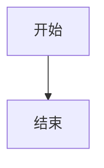

## 2. 基础流程图（带分支）

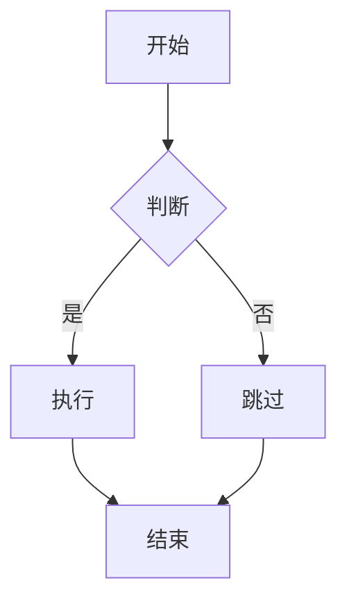

## 3. 左右方向流程图

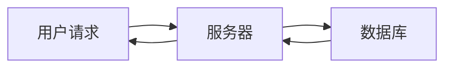

## 4. 带样式的流程图

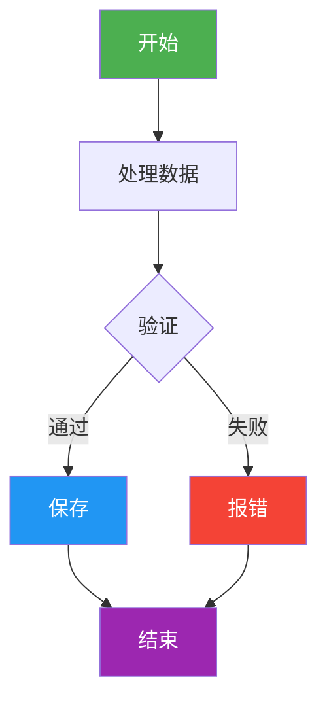

## 5. 子图（Subgraph）

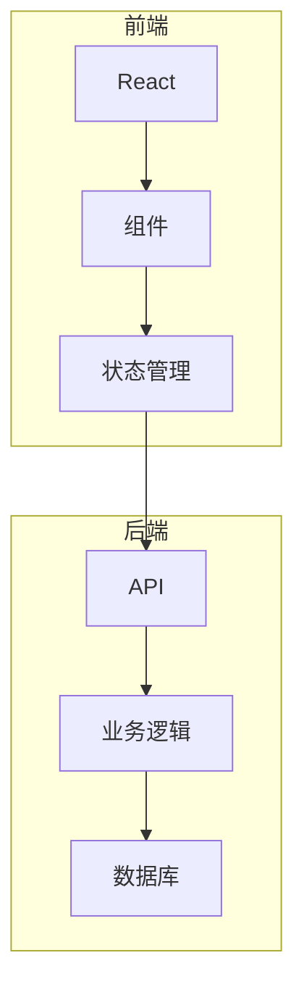

## 6. 时序图（Sequence Diagram）

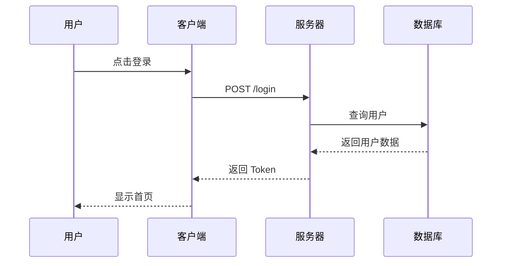

## 7. 复杂时序图（带循环和条件）

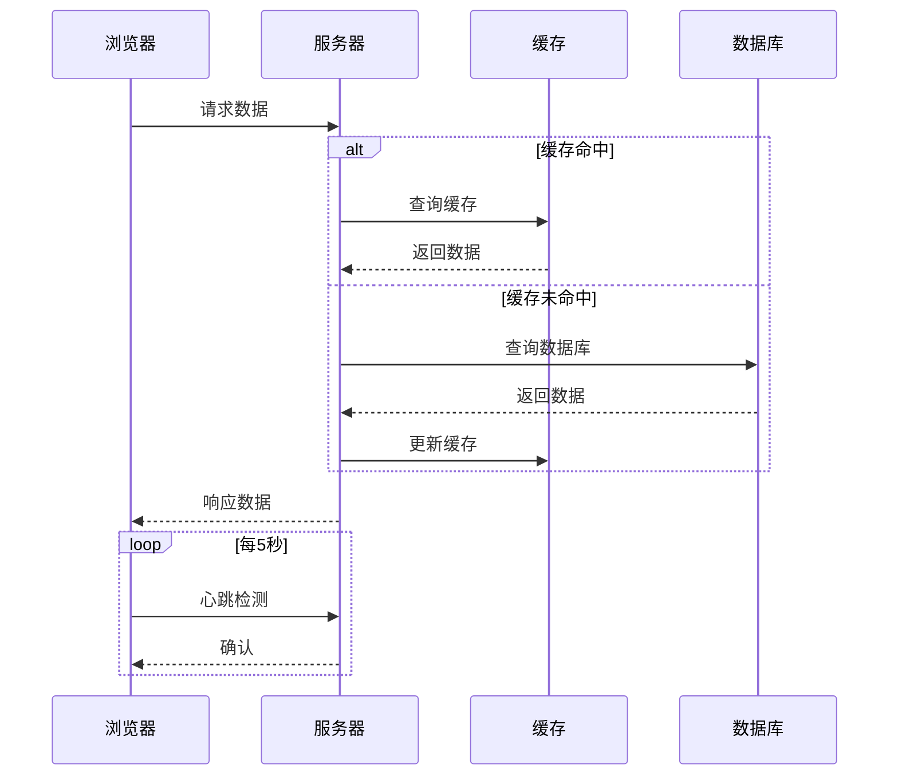

## 8. 类图（Class Diagram）

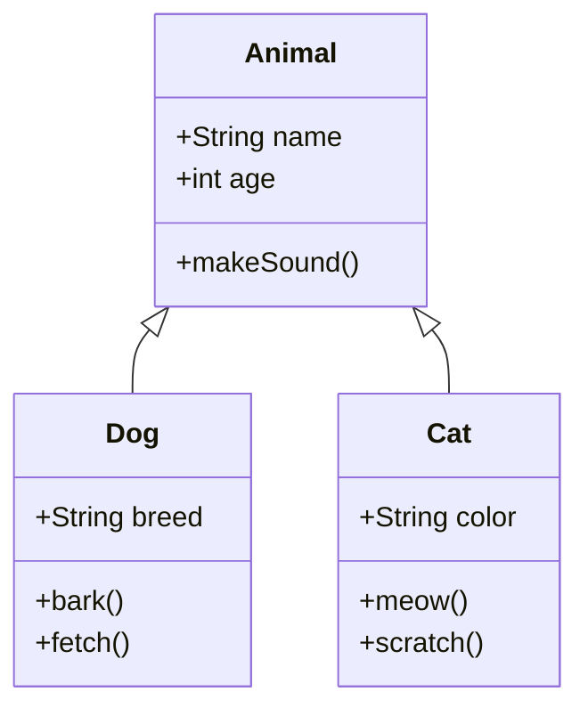

## 9. 状态图（State Diagram）

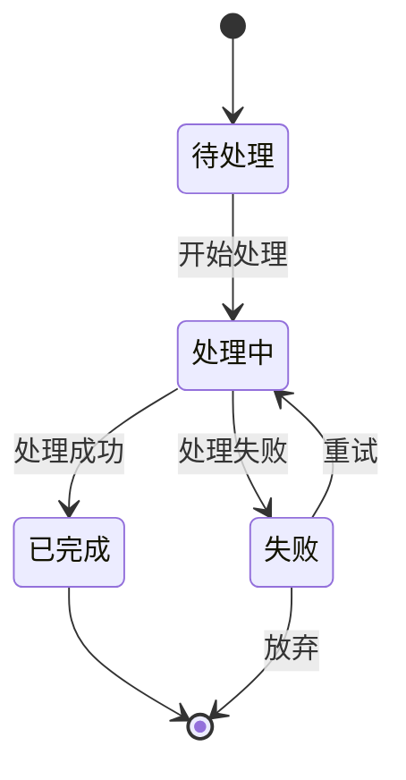

## 10. 实体关系图（ER Diagram）

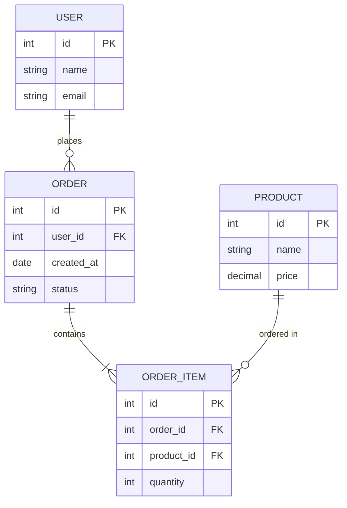

## 11. 甘特图（Gantt Chart）

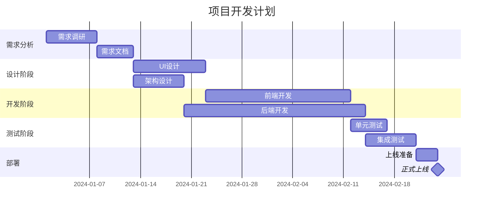

## 12. 饼图（Pie Chart）

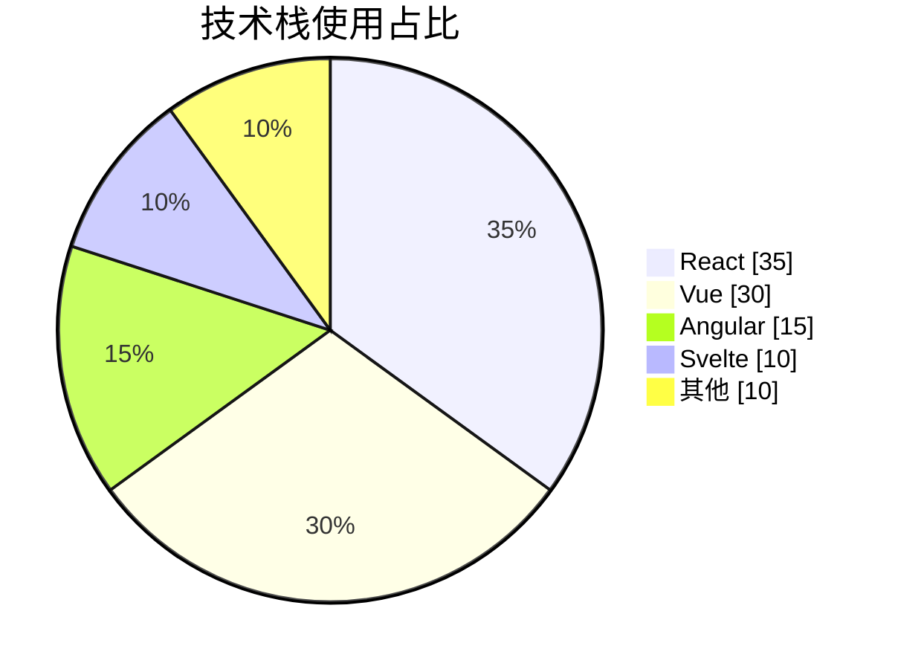

## 13. 思维导图（Mindmap）

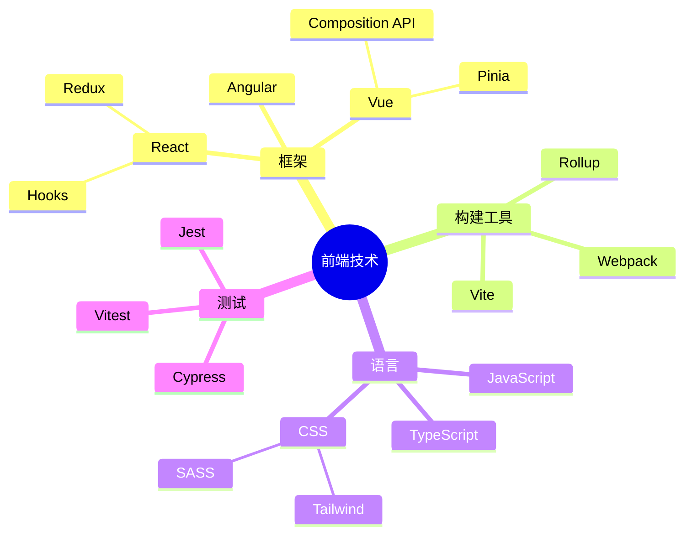

## 14. 用户旅程图（User Journey）

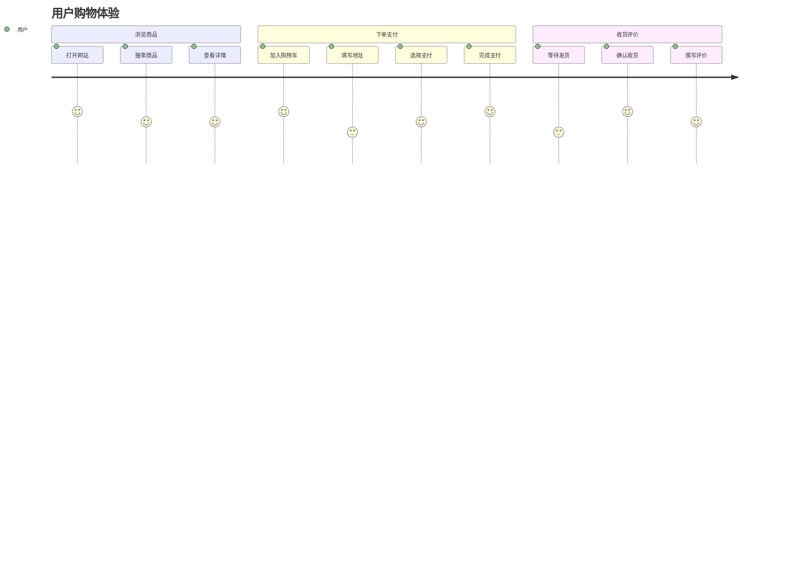

## 15. Git 图（Git Graph）

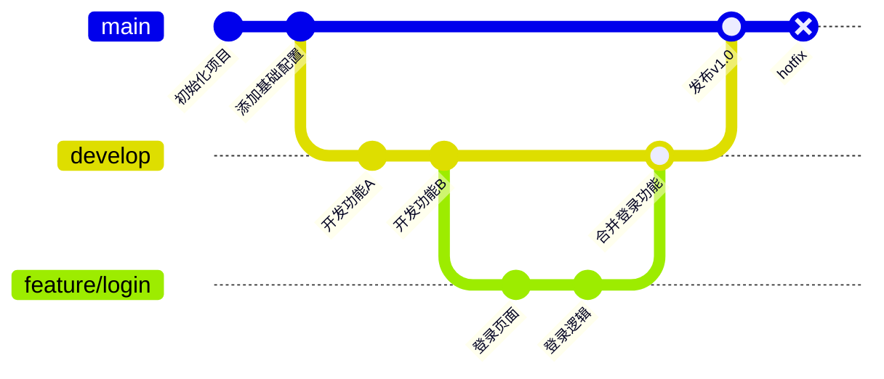

## 16. 复杂流程图（ELK 布局推荐）

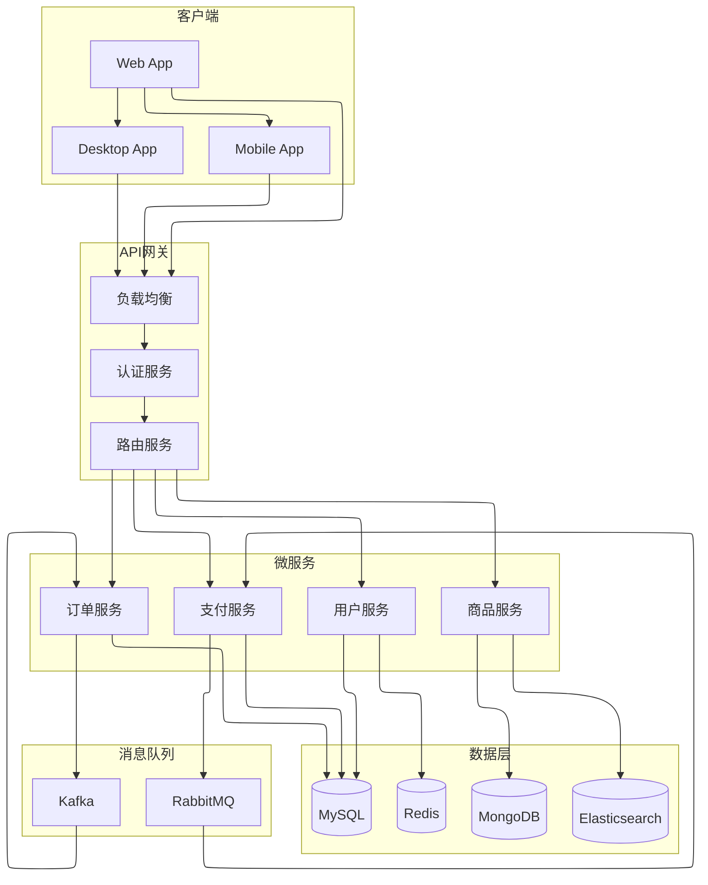

## 17. 带自定义扩展语法测试（动画）

```mermaid
graph TD
    A@{ animation: slow }[数据流入] --> B[处理中心]
    B --> C@{ animation: pulse }[输出结果]
    B --> D@{ animation: blink }[错误处理]
```

## 18. 带自定义扩展语法测试（样式）

```mermaid
graph LR
    A@{ fill:#E8F5E9; color:#1B5E20 }[成功] --> B[下一步]
    C@{ fill:#FFEBEE; color:#B71C1C }[失败] --> D[重试]
    E@{ fill:#E3F2FD; color:#0D47A1; stroke:#1565C0; stroke-width:2px }[信息] --> F[处理]
```

## 19. 架构图（Architecture - C4 Model）

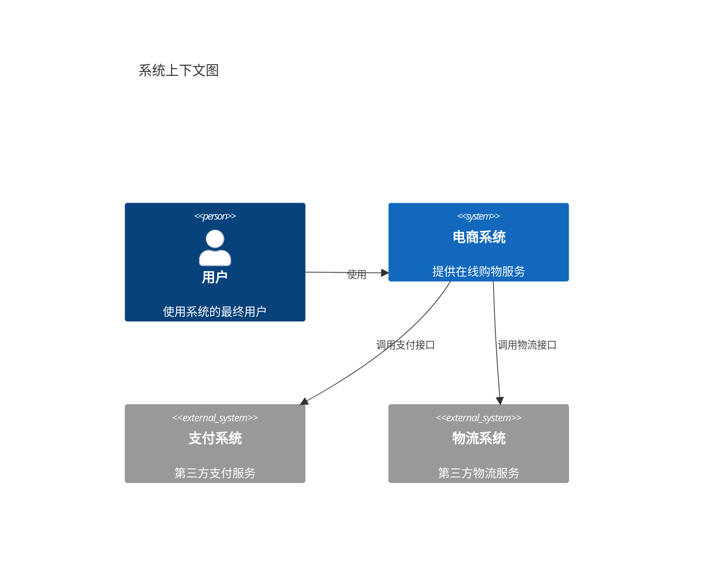

## 20. 象限图（Quadrant Chart）

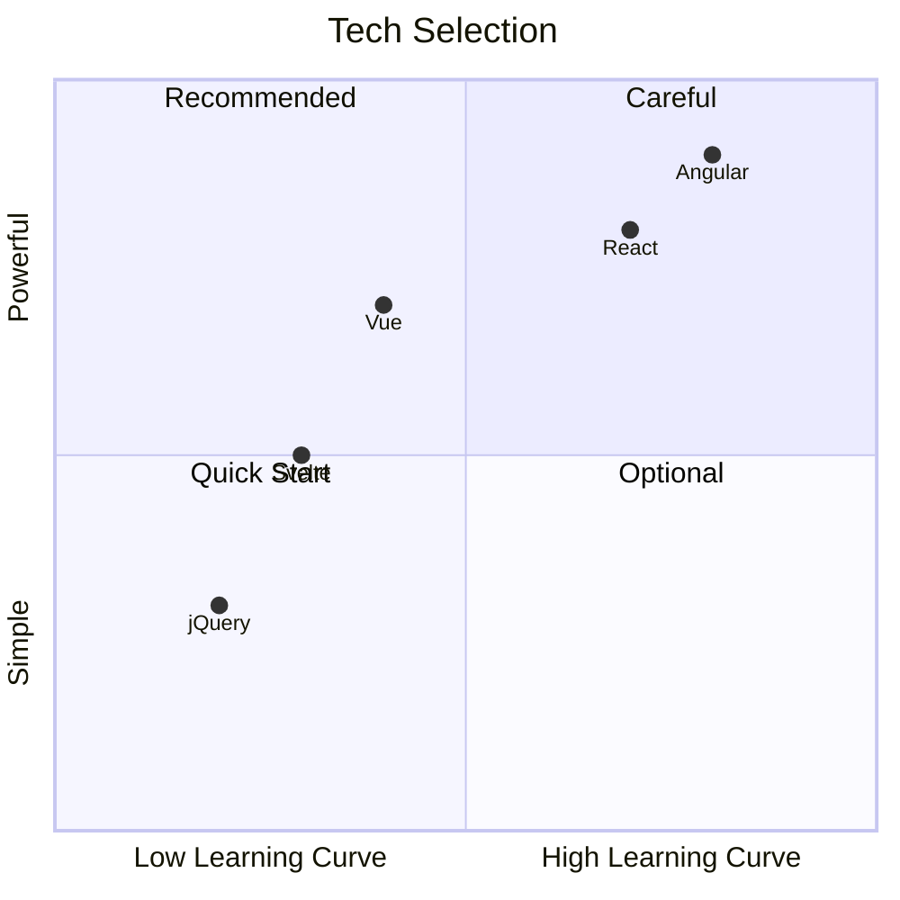
